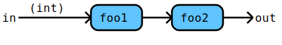

# Flow Documentation For File: sample.go

## Flow: Bla
Bla is a simple filter.

Components | Data
---------- | -----
foo2 | 
[DoBla](./sample_addition.md#flow-dobla) | 
foo1 | 

Some additional bla, bla.
