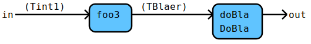

# Flow Documentation For File: sample.go

## Flow: [Bla](sample.go#L22L26)
Bla is a simple filter.

Components | Data
---------- | -----
[BlaSome](#flow-blasome) | [Tint1](sample.go#L10L10)
[foo1](sample.go#L28L31) | 
[foo2](sample.go#L33L36) | 

Some additional bla, bla.

## Flow: [BlaSome](sample.go#L43L47)
BlaSome is a simple filter.

Components | Data
---------- | -----
[DoBla](sample_addition.md#flow-dobla) | [TBlaer](sample_addition.go#L5L5)
[foo3](sample.go#L49L52) | [Tint1](sample.go#L10L10)

Some additional ...
