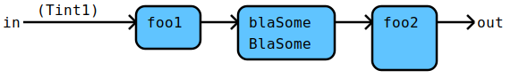

# Flow Documentation For File: sample.go

## Flow: Bla
Bla is a simple filter.

Components | Data
---------- | -----
[foo1](./sample.go#L30L33) | [Tint1](./sample.go#L10L10)
[DoBla](./sample_addition.md#flow-dobla) | [TBlaer](./sample_addition.go#L5L5)
[foo2](./sample.go#L35L38) | 

Some additional bla, bla.
