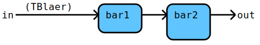

# Flow Documentation For File: sample_addition.go

## Flow: [DoBla](sample_addition.go#L20L24)
DoBla is the input port of the DoBla operation.

Components | Data
---------- | -----
[bar1](sample_addition.go#L26L29) | [TBlaer](sample_addition.go#L5L5)
[bar2](sample_addition.go#L31L34) | 

